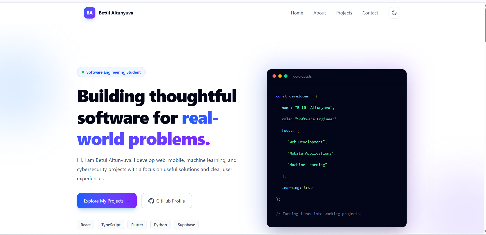
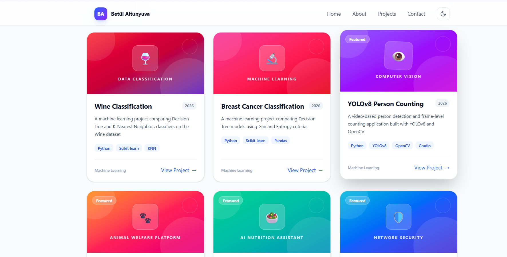

<div align="center">

# React TypeScript Web Lab

### A modern, responsive developer portfolio built with React, TypeScript, Vite, and Tailwind CSS

[](https://github.com/betulaltunyuva/react-typescript-web-lab/actions/workflows/ci.yml)


</div>

## About the Project

React TypeScript Web Lab is a responsive portfolio application created to present my software projects, technical skills, and development interests in a clear and interactive interface.

The project started as a university web-development exercise and was later redesigned as a modern personal portfolio. It demonstrates component-based architecture, type-safe development, reusable interface elements, responsive layouts, project filtering, form validation, theme management, and automated quality checks.

## Preview

<p align="center">
  
</p>

## Features

* Modern responsive portfolio design
* Light and dark theme support
* Theme preference saved in local storage
* Sticky and responsive navigation
* Mobile navigation menu
* Personal introduction and developer profile
* Categorized technical skills
* Real GitHub project information
* Project search functionality
* Category-based project filtering
* Sorting by year and title
* Custom colors and visuals for each project
* External GitHub repository links
* Frontend contact-form demonstration
* Client-side form validation
* Loading, empty, success, and error states
* Keyboard-accessible navigation
* Automated lint and build checks with GitHub Actions

## Project Collection

The portfolio presents projects from mobile development, full-stack development, machine learning, and cybersecurity.

<p align="center">
  
</p>

## Featured Projects

The portfolio currently includes the following projects:

| Project                      | Field                              | Main Technologies              |
| ---------------------------- | ---------------------------------- | ------------------------------ |
| NetWatch                     | Cybersecurity                      | Python, Flask, Scapy, SQLite   |
| AI BiBite                    | Mobile and Artificial Intelligence | Flutter, Dart, Supabase, AI    |
| PatiMap                      | Full Stack                         | Flutter, Dart, Supabase, AI    |
| YOLOv8 Person Counting       | Computer Vision                    | Python, YOLOv8, OpenCV, Gradio |
| Breast Cancer Classification | Machine Learning                   | Python, Scikit-learn, Pandas   |
| Wine Classification          | Machine Learning                   | Python, Scikit-learn, KNN      |

Project information is stored in `public/data/projects.json` and loaded asynchronously by the application.

## Technologies

| Technology     | Purpose                                    |
| -------------- | ------------------------------------------ |
| React 19       | Component-based user-interface development |
| TypeScript 5.9 | Static type checking                       |
| Vite 7         | Development server and production build    |
| Tailwind CSS 4 | Responsive interface styling               |
| React Router   | Routing support                            |
| ESLint         | Code-quality analysis                      |
| JSON           | Local project data source                  |
| GitHub Actions | Automated lint and build checks            |

## Project Structure

```text
react-typescript-web-lab/
├── .github/
│   └── workflows/
│       └── ci.yml
├── public/
│   └── data/
│       └── projects.json
├── src/
│   ├── components/
│   │   ├── forms/
│   │   │   ├── ContactForm.tsx
│   │   │   └── ProjectFilter.tsx
│   │   ├── layout/
│   │   │   ├── Footer.tsx
│   │   │   └── Header.tsx
│   │   ├── sections/
│   │   │   ├── About.tsx
│   │   │   ├── ContactSection.tsx
│   │   │   ├── Hero.tsx
│   │   │   ├── ProjectList.tsx
│   │   │   └── Skills.tsx
│   │   └── ui/
│   ├── services/
│   │   └── projectService.ts
│   ├── styles/
│   ├── types/
│   │   └── project.ts
│   ├── utils/
│   │   └── projectHelpers.ts
│   ├── App.tsx
│   ├── index.css
│   └── main.tsx
├── web-images/
│   ├── portfolio-dark.png
│   ├── portfolio-home.png
│   └── portfolio-projects.png
├── CSS-DECISIONS.md
├── eslint.config.js
├── index.html
├── package.json
├── package-lock.json
├── tsconfig.app.json
├── tsconfig.json
├── tsconfig.node.json
├── vite.config.ts
└── README.md
```

## Installation

### 1. Clone the repository

```bash
git clone https://github.com/betulaltunyuva/react-typescript-web-lab.git
cd react-typescript-web-lab
```

### 2. Install the dependencies

```bash
npm install
```

### 3. Start the development server

```bash
npm run dev
```

Open the local address displayed in the terminal, usually:

```text
http://localhost:5173
```

## Available Commands

| Command           | Description                           |
| ----------------- | ------------------------------------- |
| `npm run dev`     | Starts the Vite development server    |
| `npm run build`   | Creates a production build            |
| `npm run lint`    | Runs ESLint code-quality checks       |
| `npm run preview` | Previews the production build locally |

## Project Filtering

Users can explore the project collection by:

* Searching project titles
* Searching descriptions and technologies
* Filtering by project category
* Sorting projects by year
* Sorting projects alphabetically
* Opening the associated GitHub repository

The available categories are:

* Mobile
* Full Stack
* Machine Learning
* Cybersecurity

## Theme Management

The navigation bar includes a theme button that switches between light and dark appearances.

The selected theme is saved using `localStorage`. If the user has not previously selected a theme, the application checks the operating system's preferred color scheme.

## Contact Form

The contact form demonstrates:

* Required-field validation
* Email-format validation
* Minimum character validation
* Subject selection
* Loading state
* Success state
* Accessible form labels
* Clear validation messages

The form is a frontend demonstration. It validates the entered information but does not send messages to a backend service.

## Accessibility

The interface includes:

* Semantic HTML elements
* A skip-to-content link
* Accessible form labels
* ARIA attributes
* Keyboard-accessible navigation
* Visible interaction states
* Descriptive link text
* Responsive typography and layouts
* Light and dark theme contrast

## Continuous Integration

GitHub Actions runs automatically after every push and pull request to the `main` branch.

The CI workflow performs the following operations:

1. Downloads the repository
2. Sets up Node.js
3. Installs dependencies with `npm ci`
4. Runs ESLint
5. Creates a production build

The project is checked with:

* Node.js 20
* Node.js 22
* Node.js 24

## CSS Documentation

Detailed explanations of the project's responsive strategy, breakpoints, layout choices, and design decisions are available in:

[CSS Decisions](CSS-DECISIONS.md)

## Future Improvements

* Connect the contact form to a backend service
* Add automated component tests
* Add individual project detail pages
* Add real project screenshots to each project card
* Deploy the portfolio to a public hosting service
* Add page-transition animations

## License

This project is licensed under the MIT License. See the `LICENSE` file for details.

## Author

**Betül Altunyuva**

Software Engineering Student

[GitHub Profile](https://github.com/betulaltunyuva)

---

<div align="center">

Built with React, TypeScript, Tailwind CSS, and curiosity.

</div>
